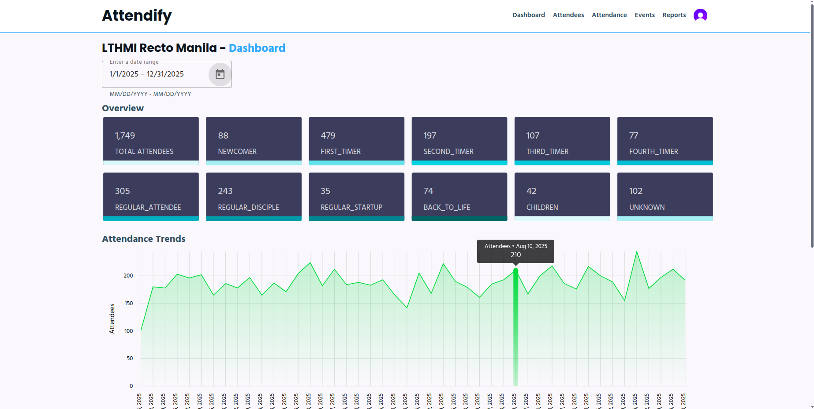
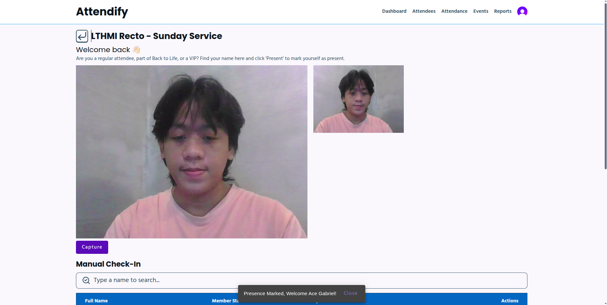

# Attendify 2.0 - Attendance Simplified
Attendify is an all-in-one platform designed to help organizations manage attendees with analytics, all with modern UX, & face recognition.

### ⭐ Check us out on Trustpilot

## Repositories
Linked services that work together to power Attendify.

## Tech Stack
  
  
  
  
  

## Attendify is currently used by
[Life Transform Harvest Ministry International](https://www.facebook.com/lthmrectomanila) — since 2024 to Present

## 📸 Screenshots

### Real-time Analytics Dashboard

*View weekly attendance trends and demographic breakdowns at a glance.*

### Face Recognition Check-in

*Seamless check-in using pre-trained Facenet512 DeepFace model.*

## 📅 Version History

### 🟢 v2.0.0 - The "Smart" Update (Current)
*Released: November 2025*  
**Focus:** Enhancing security and user experience with Face Recognition.
* **[New]** Implemented **Face Recognition**
* **[Enhanced]** Live dashboards with attendance insights, trends, and detailed reports.
* **[Enhanced]** Overall Performance & User Experience

### 🟠 v1.0.0 - The "Contactless" MVP
*Released: December 2024*  
**Focus:** Moving away from paper-based attendance.  
**Tech:** MongoDB + ExpressJS + React + NodeJS + Chakra UI
* **[Feature]** Manual "Click" Attendance. (Admins search and click "Present" for each attendee) to replace physical logbooks.
* **[Feature]** Basic Scanner Web App for church admins.
* **[Flaw Identified]** Efficiency Bottleneck: Manually searching for names and clicking them one by one was too slow during peak service hours, causing long lines or missed data.